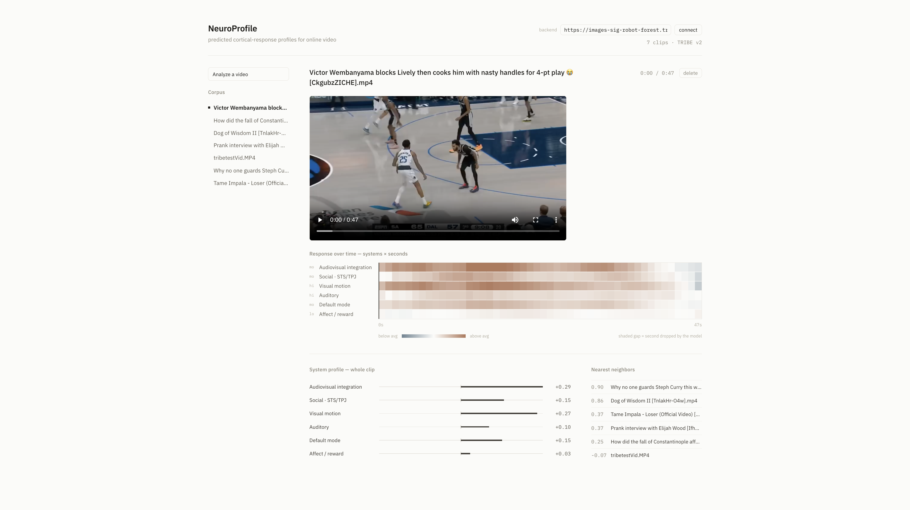

# NeuroProfile

Run a video through Meta's **TRIBE v2** brain-encoding model, reduce the predicted cortical
activity onto six functional systems over time, and store each clip as a searchable
360-dimensional vector. A Next.js dashboard plays the clip against a carpet plot of the
predicted response, second by second, and finds the nearest neighbours in the corpus.

### Demo
https://github.com/user-attachments/assets/3d72662e-6dda-4347-8d06-72c61194b155

### Dashboard 


---

## Honest claims

**These are population-average predictions from a model trained on group fMRI. They are not
a measurement of any viewer's brain, and not a claim about how a video affects anyone.**


Reliability is **tiered**, and the tiers survive from `ica/region_system_map.json` all the way
into the dashboard and the extension popup:

| system | tier | notes |
| --- | --- | --- |
| `visual_motion` | high | data-derived |
| `auditory` | high | data-derived, but a catch-all — see below |
| `audiovisual_integration` | moderate | data-derived |
| `social_sts_tpj` | moderate | data-derived |
| `dmn_scene_medial_parietal` | moderate | data-derived, also a catch-all |
| `affect_reward` | **low** | **hand-assigned, not derived** (`"derived": false`) |

Four things to know:

- **`affect_reward` is not data-derived.** TRIBE v2 released cortical weights only — there is
  no amygdala, no accumbens. It is a hand-assigned set of cortical proxies (anterior insula,
  ACC, OFC/vmPFC) and is tiered low for that reason.
- **`auditory` and `dmn_scene_medial_parietal` are catch-alls.** They hold 92 and 93 of the
  360 regions; the other four hold 35–53. Regions that load weakly on every ICA component
  fall into whichever component has the largest scale.
- **Early visual (`V1`) and primary motor (`4`) both land in `auditory`**, which is not
  anatomically meaningful. This is a known consequence of the decomposition, and those
  assignments must never be reported as findings.
- **Cortex only, 20,484 vertices.** Subcortical predictions were never released.

The full derivation, the validation that was run in detail are in
[`ica/README.md`](ica/README.md).


---

## The method

```
video ──► TRIBE v2 ──► preds (n, 20484)      cortical vertices, fsaverage5, 1 Hz
                            │
                            │ group-by-mean over ica/fsaverage5_glasser_labels.npy
                            ▼
                       region_ts (T, 360)     Glasser HCP-MMP1 parcels
                            │
                            │ group-by-mean over ica/region_system_map.json
                            ▼
                       system_ts (T, 6)       the six functional systems
                            │
                    ┌───────┴────────┐
                    ▼                ▼
        summary_vec (360,)     system_profile (6,)
        the Qdrant search key   what the bars show
```

The six systems were not chosen by hand. TRIBE's latent→cortex readout (a `(1, 2048, 20484)`
subject head) was decomposed with `FastICA(n_components=5)`, treating the 2048 latent
dimensions as samples and the vertices as features, so each component is a spatial map over
cortex. Every Glasser region was assigned to the component it loads onto most strongly.
`affect_reward` is the one exception — added by hand, flagged, and tiered low.

---

## Architecture

```
    capture                        analysis (GPU)                read + display
 ┌───────────────┐           ┌────────────────────────┐       ┌────────────────┐
 │  dashboard    │  POST     │  analyze_server.py     │       │  Next.js       │
 │  upload       ├─/analyze─►│                        │       │  dashboard     │
 └───────────────┘           │  fetcher (yt-dlp)      │       │                │
                             │  chunker  100s/10s     │       │  carpet plot   │
                             │  chunk_runner  ──┐     │       │  system bars   │
                             │   one subprocess │     │       │  neighbours    │
                             │   per chunk      ▼     │       │  synced video  │  
                             │         _encode_worker.py      └───────▲────────┘
                             │         TRIBE v2 on CUDA               │
                             │  stitcher → reducer    │               │
                             └───────────┬────────────┘               │
                                         │                            │
                              Qdrant videos_v1 (360-d cosine)         │
                              data/timelines/*.npz  ──────────► backend/serve.py
                                                                  (offline, no GPU)
```

**Two run modes.**

- **Offline** — `serve.py` reads an already-encoded corpus (Qdrant vectors + timeline
  `.npz` + the original media) off disk. No GPU, no model, no network. This is the demo path.
- **Live** — `batch_encoding/analyze_server.py` on a CUDA box (Colab behind a cloudflared
  tunnel for development) accepts uploads and encodes them. It serves the same read API plus
  `/analyze`, `/jobs/{id}` with a live stage log, and `/jobs/{id}/cancel`.

The dashboard's **backend** field takes either one. It is stored in `localStorage`, which
matters because a cloudflared tunnel URL changes every session — no rebuild needed.

**The split that matters:** everything that touches the model lives in `batch_encoding/` and
needs CUDA + `tribev2` + gated Llama-3.2-3B. Everything else — `backend/` (including
`serve.py`),
`tests/`, `frontend/` — is model-free and runs and tests on a laptop against fake arrays.

Some details that were expensive to learn and are cheap to break:

- **One subprocess per chunk.** `chunk_runner.encode_chunk` spawns `_encode_worker.py`, which
  encodes exactly one chunk and exits, reclaiming all VRAM. Memory is O(1) in chunk count.
- **Video + text on the GPU (fp16), audio on the CPU.** Audio (wav2vec2-bert) has quadratic
  attention and spikes VRAM. Text on the GPU avoids a ~12 GiB fp32 Llama load in CPU RAM that
  SIGKILLs the worker. `NP_TEXT_CPU=1` and `NP_AUDIO_GPU=1` are the escape hatches.
- **`reducer.py` reads `ica/` at import time using relative paths**, so every entry point does
  `os.chdir(REPO_ROOT)` first. Keep that preamble in anything new.
- **`timeline_path` in a payload is a basename, not a path** — timelines move between Drive
  and local, and each reader resolves it against its own `--timelines-dir`.
- **Embedded Qdrant holds a single-process lock.** `serve.py` and `analyze_server.py` cannot
  open the same `qdrant_data/` at the same time; use `docker-compose.yml` if you need both.

---

## Run it

### Offline demo (no GPU)

```bash
python -m venv .venv && .venv/bin/pip install -r requirements.txt

# a corpus is qdrant_data/ + data/timelines/*.npz + the original media in data/videos/.
# --prewarm builds the browser-playable copy of each clip up front instead of on first click.
.venv/bin/python backend/serve.py \
    --qdrant-path ./qdrant_data \
    --timelines-dir ./data/timelines \
    --videos-dir ./data/videos \
    --prewarm                                     # http://localhost:8000

cd frontend && npm install && npm run dev         # http://localhost:3000
```

No corpus yet? `backend/serve.py --mock` seeds four obviously-synthetic clips (titled `MOCK — …`) so
the UI has something to draw. `backend/serve.py --check` reports which stored clips have no playable
media file, which is the usual thing to go wrong after syncing a corpus down from Drive.

A clip encoded as `video_id = "file:<stem>"` plays only if `<stem>.<ext>` is in
`--videos-dir` — so `file:coral_reefs` needs `data/videos/coral_reefs.mp4`.

### Live encoding (GPU)

`notebooks/neuroprofile_colab.ipynb` is the working GPU environment. On any CUDA box: (Essentially just run neuroprofile_colab.ipynb, get cloudflare tunnel url, start up webserver and then paste it and connect to it in the dashboard.)

```bash
bash batch_encoding/setup_gpu.sh                  # pinned deps, HF auth, punkt
python batch_encoding/test_encode.py clip.mp4     # smoke test — use a clip over 100 s

python batch_encoding/analyze_server.py \
    --qdrant-path /content/drive/MyDrive/neuroprofile/qdrant_data \
    --timelines-dir /content/drive/MyDrive/neuroprofile/data/timelines \
    --videos-dir /content/drive/MyDrive/neuroprofile/videos
cloudflared tunnel --url http://localhost:8000
```

Paste the tunnel URL into the dashboard's **backend** field (or the extension popup's), and
uploads encode on the GPU with a live per-stage log and a cancel button.

Two Colab-specific gotchas, both already handled in the notebook: Colab IPs are
YouTube-blocked, so **feed file paths, not URLs**; and TRIBE's `eventstransforms.py` is
patched from `["uvx", "whisperx"]` to `["whisperx"]` because `uvx` re-downloads ~3.5 GB per
call. Persist everything to Drive — a runtime disconnect mid-corpus should be recoverable.

For an unattended corpus grind: `python batch_encoding/batch_encode.py --corpus corpus.txt`.

### Tests

```bash
.venv/bin/python -m pytest -q          # from the repo root — reducer.py np.loads "ica/..."
```

Everything runs on CPU against synthetic data. The ffmpeg-dependent tests skip cleanly if
ffmpeg is absent.

---

## Layout

| path | what |
| --- | --- |
| `backend/` | `chunker`, `stitcher`, `reducer`, `storage`, `input_handler`, `serving`, `fetcher` — model-free, tested |
| `batch_encoding/` | GPU side: `analyze_server.py`, `batch_encode.py`, `chunk_runner.py`, `_encode_worker.py` |
| `backend/serve.py` | the offline read-only API (run it from the repo root) |
| `frontend/` | the Next.js dashboard |
| `ica/` | **frozen** reduction mapping + its derivation (`ica/README.md`). Load-bearing. |
| `tests/` | pytest suite; `tests/reducer_reference.npz` is a committed regression oracle |
| `notebooks/` | the Colab GPU environment and the ICA analysis |

## Built with

Python · FastAPI · Qdrant · NumPy/SciPy · PyTorch (GPU side) · ffmpeg ·
Next.js 14 / React / TypeScript · (offscreen documents + `tabCapture`) · yt-dlp ·
Colab + cloudflared
